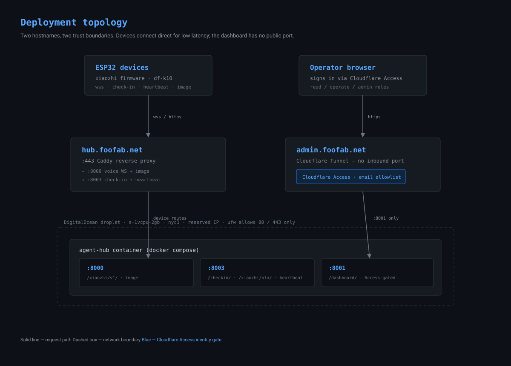
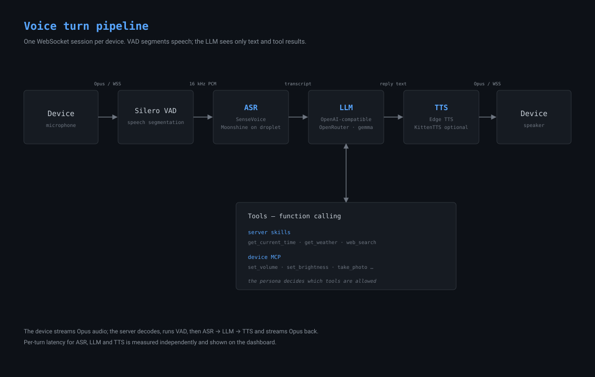
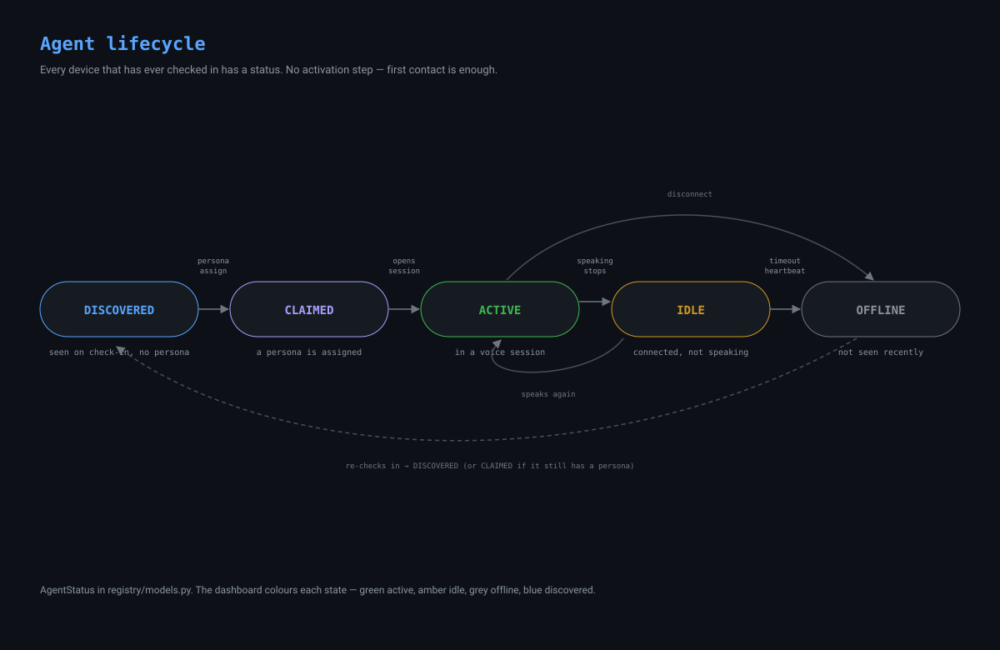

# Architecture

Three diagrams that together describe how agent-hub is deployed and how it
runs. Sources are in [`diagrams/`](diagrams/) as standalone SVG — drop them
into slides, embed them elsewhere, or open
[`diagrams/`](diagrams/) directly.

## Deployment topology

Two hostnames, two trust boundaries. Devices connect **direct** through Caddy
because voice is latency-critical and an ESP32 cannot complete an interactive
login; the dashboard has **no public port** at all — it is reached only through
a Cloudflare Tunnel, behind Cloudflare Access.

See [`deployment.md`](deployment.md) for the compose files, ports, and
hardening notes.

## Voice turn pipeline

Every spoken turn runs over one WebSocket session: the device streams Opus,
the server decodes it, segments speech with Silero VAD, then ASR → LLM → TTS,
and streams Opus back. The LLM never sees audio — only the transcript and tool
results. Tools come from two places: server-side skills and the device's own
MCP tools, gated per persona.

See [`concepts.md`](concepts.md) for a plain-English walk-through of ASR, the
LLM, TTS, personas, and MCP tools.

## Agent lifecycle

Every device that has ever checked in has an `AgentStatus`
(`registry/models.py`). There is no activation step — first contact is enough
to register a device and bind it to the `hub-default` persona.

## Notes

- The diagrams show `OpenRouter · gemma` and `df-k10` as concrete examples;
  the exact model id and device names depend on the deployment.
- SVGs match the dashboard's palette (GitHub-dark, `#58a6ff` accent, the
  status colours). They carry their own background, so they render on a light
  or dark page.
